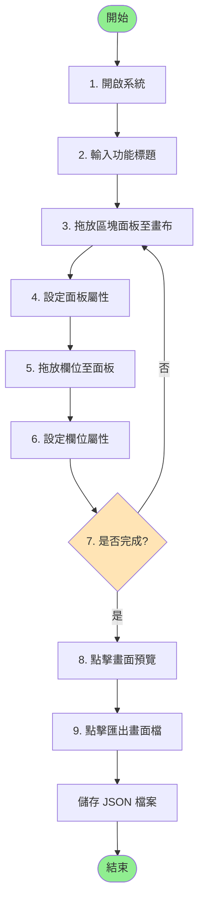
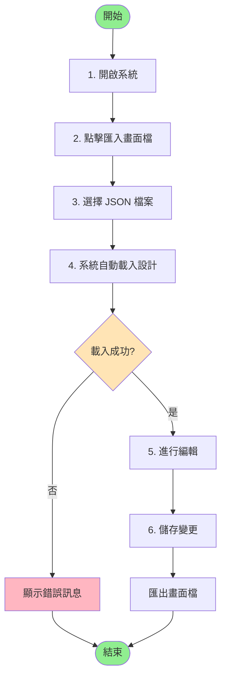
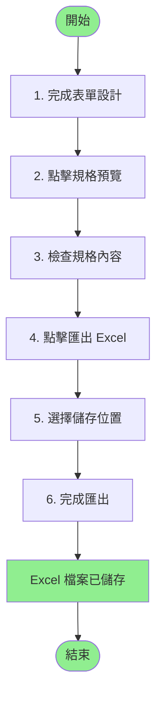

# ERP 畫面輔助產生器 - 系統需求規格書

## 文件資訊

- **文件名稱**：ERP 畫面輔助產生器 - 系統需求規格書
- **版本**：1.5
- **建立日期**：2025年
- **最後更新**：2025年1月
- **文件目的**：提供開發團隊完整的系統功能規格說明，作為系統開發與維護的依據

---

## 1. 系統概述

### 1.1 系統簡介

ERP 畫面輔助產生器是一個視覺化的表單設計工具，允許使用者透過拖放方式快速建立 ERP 系統的表單畫面。系統提供直觀的介面，讓使用者能夠設計複雜的表單佈局，並自動產生對應的欄位規格文件。

### 1.2 系統目標

- 提供視覺化的表單設計介面
- 簡化 ERP 表單開發流程
- 自動產生標準化的欄位規格文件
- 支援多種欄位類型和佈局方式
- 提供預覽功能，確保設計符合需求

### 1.3 技術架構

- **前端技術**：HTML5、CSS3、JavaScript (ES6+)
- **資料格式**：JSON
- **外部函式庫**：
  - SheetJS (xlsx-js-style) - Excel 匯出功能
  - File System Access API - 檔案讀寫功能
  - IndexedDB - 本地資料儲存

---

## 2. 功能需求

### 2.1 面板管理功能

#### 2.1.1 區塊面板（無頁籤）
- **功能描述**：建立一個沒有頁籤的容器面板
- **操作方式**：從左側工具列拖放「區塊面板(無頁籤)」至畫布
- **功能特性**：
  - 可設定欄數（3-5欄）
  - 可設定列高
  - 可設定資料表識別、關聯的父表、DB資料表名
  - 可設定頁籤標題
  - 可收合/展開面板
  - 可刪除面板

#### 2.1.2 區塊面板（有頁籤）
- **功能描述**：建立一個包含多個頁籤的容器面板
- **操作方式**：從左側工具列拖放「區塊面板(有頁籤)」至畫布
- **功能特性**：
  - 每個頁籤為獨立的容器
  - 可新增/刪除頁籤
  - 頁籤可拖曳調整順序
  - 每個頁籤可獨立設定：
    - 欄數
    - 列高
    - 資料表識別
    - 關聯的父表
    - DB資料表名
    - 頁籤標題
  - 可收合/展開面板
  - 可刪除面板

#### 2.1.3 GRID 面板
- **功能描述**：建立一個表格容器，用於顯示多行資料
- **操作方式**：從左側工具列拖放「GRID 面板」至畫布
- **功能特性**：
  - 預設建立 4 列資料行
  - 可新增/刪除欄位（表頭）
  - 可新增/刪除資料行
  - 可調整欄寬（拖曳表頭邊界）
  - 可編輯表頭名稱
  - 可設定資料表識別、關聯的父表、DB資料表名
  - 可設定頁籤標題
  - 支援水平/垂直捲軸（當內容超出時）
  - 可收合/展開面板
  - 可刪除面板

### 2.2 欄位管理功能

#### 2.2.1 支援的欄位類型

##### 2.2.1.1 單行文字
- **用途**：輸入單行文字資料（如：客戶名稱、單號）
- **屬性設定**：
  - 標題
  - DB欄位名稱(Eng)
  - 欄寬（小/中/全寬）
  - 列高（1-5列）
  - 文字顏色
  - 長度（字元數）
  - 欄位類型（實欄位/虛欄位/關聯欄位）
  - **欄位型態**（文字/數字/日期時間/其他，可自定義）
  - 預設值
  - 必填/唯讀/主鍵
  - 下拉選項
  - 關聯功能 / 關聯欄位 / 返回欄位
  - 其他說明

##### 2.2.1.2 數值欄位
- **用途**：輸入數值資料（如：數量、金額）
- **屬性設定**：同單行文字，但僅接受數值輸入

##### 2.2.1.3 日期欄位
- **用途**：選擇日期（如：下單日）
- **屬性設定**：同單行文字，但提供日期選擇器

##### 2.2.1.4 下拉選單
- **用途**：從預設選項中選擇（如：狀態）
- **屬性設定**：
  - 同單行文字
  - 下拉選項（以分號分隔，如：選項1;選項2;選項3）
- **欄位型態自動設定**：預設為 "Byte"
- **其他說明自動填入**：當欄位型態為 "Byte" 時，自動在第一行填入 "控件:TextOption-文本選項" 並換行

##### 2.2.1.9 核取方塊
- **用途**：單一核取方塊控件（如：是否啟用）
- **屬性設定**：
  - 同單行文字
  - 支援預設值（勾選/未勾選）
- **欄位型態自動設定**：預設為 "Boolean"
- **其他說明自動填入**：當欄位型態為 "Boolean" 時，自動在第一行填入 "控件:CheckEdit-(CheckBox)控件" 並換行

##### 2.2.1.10 複選控件
- **用途**：多個核取方塊控件群組（如：興趣選項）
- **屬性設定**：
  - 同單行文字
  - 下拉選項（以分號分隔，如：選項1;選項2;選項3）
  - 選項由左而右排列，自動換行
- **欄位型態自動設定**：預設為 "Int/LongInt/Double/SmallInt"
- **其他說明自動填入**：當欄位型態為 "Int/LongInt/Double/SmallInt" 時，自動在第一行填入 "控件:CheckBoxGroup-複選控件" 並換行

##### 2.2.1.11 單選控件
- **用途**：單選按鈕群組（如：性別、狀態）
- **屬性設定**：
  - 同單行文字
  - 下拉選項（以分號分隔，如：選項1;選項2;選項3）
  - 選項由左而右排列，自動換行
- **欄位型態自動設定**：預設為 "Int/LongInt/Double/SmallInt"
- **其他說明自動填入**：當欄位型態為 "Int/LongInt/Double/SmallInt" 時，自動在第一行填入 "控件:RadioGroup-單選控件" 並換行

##### 2.2.1.5 多行備註
- **用途**：輸入多行文字（如：備註說明）
- **屬性設定**：同單行文字，但支援多行輸入

##### 2.2.1.6 空欄位
- **用途**：空白佔位，用於版面調整
- **屬性設定**：僅欄寬和列高

##### 2.2.1.7 按鈕
- **用途**：按鈕控件
- **屬性設定**：
  - 標題（按鈕文字，可直接編輯）
  - 欄寬
  - 列高（預設較小）
- **功能特性**：
  - 按鈕文字可直接點擊編輯
  - 文字自動置中對齊
  - 支援貼上純文字（自動移除格式）

##### 2.2.1.8 固定文字
- **用途**：固定顯示的文字（不可編輯）
- **屬性設定**：
  - 標題（顯示文字）
  - 欄寬
  - 列高

#### 2.2.2 欄位操作
- **拖放**：從左側工具列拖放欄位至面板容器中
- **選取**：點擊欄位進行選取
- **刪除**：選取欄位後點擊刪除按鈕
- **屬性編輯**：選取欄位後在右側屬性面板編輯
- **欄位規格設定**：點擊「開窗設定」按鈕開啟詳細設定視窗
- **標題直接編輯**：點擊欄位標題可直接編輯，支援貼上純文字（自動移除格式）
- **按鈕文字直接編輯**：點擊按鈕文字可直接編輯，文字置中對齊，支援貼上純文字（自動移除格式）

#### 2.2.3 欄位型態自動填入
- **功能描述**：根據欄位標題關鍵字自動填入對應的欄位型態
- **觸發時機**：當欄位標題改變時（在屬性面板編輯或直接編輯標題）
- **自動判斷規則**：
  - 標題包含「單號」或「編號」→ 自動填入「Text」
  - 標題包含「名稱」→ 自動填入「NTText」
  - 標題包含「日期」→ 自動填入「Date」
  - 標題包含「金額」→ 自動填入「Numeric」
  - 標題包含「序號」或「標識號」→ 自動填入「Int/LongInt/Double/SmallInt」
  - 標題包含「數量」→ 自動填入「Numeric」
  - 標題包含「單價」→ 自動填入「Numeric」
  - 標題包含「%」→ 自動填入「Numeric」
  - 標題包含「代碼」→ 自動填入「Text」
  - 標題包含「重量」→ 自動填入「Numeric」
  - 標題包含「折數」→ 自動填入「Numeric」
  - 標題包含「比率」→ 自動填入「Numeric」
  - 標題包含「幣別」→ 自動填入「Text」
  - 標題包含「備註」→ 自動填入「ShortMemo」
  - 標題包含「時間」→ 自動填入「DateTime」
- **功能特性**：
  - 僅在欄位型態為空或與自動判斷的型態不同時才自動填入
  - 用戶可手動修改自動填入的欄位型態
  - 支援預定義選項和自定義輸入

#### 2.2.4 欄位型態自動設定
- **功能描述**：根據欄位類型自動設定對應的欄位型態
- **自動設定規則**：
  - **下拉選單**：自動設定為 "Byte"
  - **核取方塊**：自動設定為 "Boolean"
  - **複選控件**：自動設定為 "Int/LongInt/Double/SmallInt"
  - **單選控件**：自動設定為 "Int/LongInt/Double/SmallInt"
- **功能特性**：
  - 僅在欄位型態為空時才自動設定
  - 用戶可手動修改自動設定的欄位型態

#### 2.2.5 其他說明自動填入
- **功能描述**：根據欄位類型和欄位型態自動填入「其他說明」內容
- **觸發時機**：
  - 創建欄位時
  - 選擇欄位時
  - 欄位型態變更時
- **自動填入規則**：
  - **下拉選單** + 欄位型態 "Byte" → 自動填入 "控件:TextOption-文本選項"
  - **核取方塊** + 欄位型態 "Boolean" → 自動填入 "控件:CheckEdit-(CheckBox)控件"
  - **複選控件** + 欄位型態 "Int/LongInt/Double/SmallInt" → 自動填入 "控件:CheckBoxGroup-複選控件"
  - **單選控件** + 欄位型態 "Int/LongInt/Double/SmallInt" → 自動填入 "控件:RadioGroup-單選控件"
- **功能特性**：
  - 自動填入的文字會放在第一行，並自動換行
  - 如果「其他說明」中已包含對應文字，則不會重複填入
  - 保留原有的「其他說明」內容

### 2.3 版面設計功能

#### 2.3.1 拖放功能
- **面板拖放**：從工具列拖放面板至畫布
- **欄位拖放**：從工具列拖放欄位至面板容器
- **面板排序**：在畫布上拖放面板調整順序
- **頁籤排序**：在面板內拖放頁籤調整順序

#### 2.3.2 版面設定
- **預設欄數**：可設定畫布的預設欄數（3/4/5欄）
- **欄寬設定**：每個欄位可設定為小（1欄）/中（2欄）/全寬
- **列高設定**：每個欄位可設定列高（1-5列）
- **固定間距**：欄位間垂直間距固定為 4px，累加計算

#### 2.3.3 版面調整
- **面板收合**：點擊面板標題旁的收合按鈕
- **面板展開**：點擊收合的面板標題
- **面板刪除**：點擊面板右上角的刪除按鈕
- **欄位刪除**：選取欄位後點擊刪除按鈕

### 2.4 預覽功能

#### 2.4.1 畫面預覽
- **功能描述**：預覽設計的表單畫面
- **操作方式**：點擊頂部「畫面預覽」按鈕
- **功能特性**：
  - 顯示實際的表單外觀
  - 隱藏編輯工具（刪除按鈕、調整工具等）
  - 保留欄位輸入功能
  - 空欄位不顯示 placeholder
  - 支援頁籤切換（對於有頁籤的面板）
  - 支援面板收合/展開
  - 支援 GRID 欄寬調整
  - 可關閉預覽視窗

#### 2.4.2 規格預覽
- **功能描述**：預覽欄位規格文件
- **操作方式**：點擊頂部「規格預覽」按鈕
- **功能特性**：
  - 以面板為群組顯示
  - 對於有頁籤的面板，以頁籤順序顯示
  - 顯示區塊屬性（資料表識別、頁籤標題、關聯的父表、DB資料表名）
  - 顯示欄位屬性（欄位名稱、**DB欄位名稱(Eng)**、長度、欄位類型、**欄位型態**、預設值、必填、唯讀、主鍵、下拉選項、關聯功能/關聯欄位/返回欄位、其他說明）
  - **欄位型態顯示**：顯示名稱和描述，換行顯示（第一行：名稱，第二行：描述）
  - **欄位對齊**：「長度 (字元)」、「必填」、「唯讀」、「主鍵」欄位置中對齊
  - 支援換行顯示（欄位型態、關聯功能/關聯欄位/返回欄位、其他說明）
  - **空值顯示**：「長度」和「其他說明」欄位如果沒有值，顯示為空白（不顯示 "N/A"）
  - 專業的視覺設計（淺藍色主題）
  - 可關閉預覽視窗

### 2.5 匯出/匯入功能

#### 2.5.1 匯出畫面檔
- **功能描述**：將設計的表單佈局匯出為 JSON 檔案
- **操作方式**：點擊頂部「匯出畫面檔」按鈕
- **檔案格式**：JSON
- **檔案命名**：`{功能標題}_yyyy-MM-dd.json`
- **包含資料**：
  - 功能標題
  - 面板資訊（類型、屬性、欄位）
  - 欄位資訊（類型、屬性、值）
  - GRID 資訊（欄位、資料行）
  - 頁籤資訊（標題、屬性、欄位）

#### 2.5.2 匯入畫面檔
- **功能描述**：從 JSON 檔案載入表單佈局
- **操作方式**：點擊頂部「匯入畫面檔」按鈕，選擇 JSON 檔案
- **支援格式**：
  - 新版格式：`{meta: {version}, layout: {...}}`
  - 舊版格式：`{layout: {...}}`
  - 直接格式：`{panels: [...]}`
- **功能特性**：
  - 自動識別檔案格式
  - 載入前清空畫布
  - 個別面板載入錯誤不影響其他面板
  - 顯示載入成功/失敗訊息

#### 2.5.3 匯出 Excel（規格預覽）
- **功能描述**：將欄位規格匯出為 Excel 檔案
- **操作方式**：在「規格預覽」視窗中點擊「匯出 Excel」按鈕
- **檔案格式**：XLSX（支援樣式）
- **檔案命名**：`{功能標題}_yyMMdd_欄位規格.xlsx`
- **工作表命名**：使用功能名稱（限制 31 個字符）
- **功能特性**：
  - 所有面板和頁籤的資料合併到單一工作表
  - 不同面板/頁籤之間以空行分隔
  - 標題行：紅色文字、淺藍色背景、細邊框
  - 表頭行：深藍色文字、淺藍色背景、細邊框
  - 資料行：黑色文字、白色背景、細邊框
  - **欄位型態欄位**：顯示名稱和描述，換行顯示（第一行：名稱，第二行：描述），自動換行
  - **欄位對齊**：「長度 (字元)」、「必填」、「唯讀」、「主鍵」欄位置中對齊（標題和內容）
  - 支援換行顯示（欄位型態、關聯功能/關聯欄位/返回欄位、其他說明）
  - **空值顯示**：「長度」和「其他說明」欄位如果沒有值，顯示為空白（不顯示 "N/A"）
  - 預設行高 30（約 40 像素）
  - 自動設定列寬
  - 嘗試記憶匯出路徑（依賴瀏覽器自動記憶）

### 2.6 主題切換功能

#### 2.6.1 主題色系選擇
- **功能描述**：切換系統的主題色系
- **操作方式**：點擊標題列右側的主題按鈕組
- **支援主題**：
  - **NBS（綠色系）**：預設主題，使用綠色系配色
  - **T9（藍色系）**：藍色系主題，參考 ERP 系統風格
  - **T8（橘色系）**：橘色系主題，溫暖的橘色調
- **功能特性**：
  - 使用按鈕組切換，不使用下拉選單
  - 每個按鈕顯示對應的主題色
  - 當前選中的主題按鈕有明顯的視覺反饋
  - 主題設定會自動保存到本地儲存
  - 畫面預覽會跟隨主題變化
  - 規格預覽和 Excel 匯出不受主題影響（使用固定配色）

### 2.7 其他功能

#### 2.7.1 登入功能
- **功能描述**：進入主畫面前需要登入驗證
- **操作方式**：開啟系統後顯示登入畫面
- **功能特性**：
  - 帳號欄位：提示「員工編號」
  - 密碼欄位：密碼輸入
  - 固定驗證：帳號「chi」，密碼「23736165」
  - 驗證失敗：顯示錯誤訊息，清空密碼欄位並重新聚焦
  - 驗證成功：進入主畫面
  - 登出功能：點擊標題列「登出」按鈕可返回登入畫面
  - **登出時清空畫布**：登出時自動清空畫布上的所有面板和欄位，功能標題恢復為預設值 "功能名稱"

#### 2.7.2 載入範本功能
- **功能描述**：從範本資料夾載入預設的表單設計範本
- **操作方式**：點擊頂部「載入範本」按鈕
- **功能特性**：
  - **預設路徑**：相對路徑 `./template/` 資料夾
  - **自動載入**：開啟視窗時自動載入範本資料夾的 JSON 檔案列表
  - **範本預覽**：點擊範本項目可直接在右側預覽範本畫面
  - **視窗調整**：可調整視窗的寬度和高度（拖曳右下角）
  - **預覽畫布調整**：預覽畫布會自動調整高度以配合視窗高度
  - **選擇資料夾**：可選擇本機檔案系統的範本資料夾
  - **產生檔案列表**：在本機模式下，可產生 `template-list.json` 檔案
  - **記憶路徑**：使用 IndexedDB 記憶上次選擇的範本資料夾（本機模式）
  - **支援格式**：支援 HTTP/HTTPS 和本機檔案系統（file:///）

#### 2.7.3 清空畫布
- **功能描述**：清除畫布上所有面板和欄位
- **操作方式**：點擊頂部「清空畫布」按鈕（帶垃圾桶圖示）
- **確認機制**：點擊後立即清空（無確認對話框）

#### 2.7.4 功能標題設定
- **功能描述**：設定表單的功能標題
- **操作方式**：在畫布頂部的標題輸入框輸入
- **用途**：用於匯出檔案的命名和規格文件的標題

#### 2.7.5 標題列按鈕圖示
- **功能描述**：標題列按鈕配有圖示，提升視覺識別度
- **按鈕圖示**：
  - **畫面預覽**：眼睛圖示（👁️）
  - **規格預覽**：文件圖示（📄）
  - **載入範本**：文件夾圖示（📁）
  - **清空畫布**：垃圾桶圖示（🗑️）
  - **匯出畫面檔**：上傳圖示（⬆️）
  - **匯入畫面檔**：下載圖示（⬇️）
  - **登出**：登出圖示（↪️）

---

## 3. 使用者介面規格

> **注意**：本文件中的示意圖建議使用實際系統截圖。截圖應儲存在 `images/` 目錄下，並在對應位置引用。

### 3.1 整體佈局

**建議截圖位置**：開啟系統後，截取完整的主畫面

**截圖說明**：
- 檔案名稱：`main-layout.png`
- 應包含：頂部工具列、左側工具列、中央畫布、右側屬性面板
- 建議解析度：1920x1080 或更高

**示意圖**（建議替換為實際截圖）：

```
┌─────────────────────────────────────────────────────────────────────────┐
│  [畫面輔助產生器] [👁️畫面預覽] [📄規格預覽] [🗑️清空畫布] [⬆️匯出畫面檔] [⬇️匯入畫面檔] [預設欄數: 3欄▼] [主題色系: NBS T9 T8] │
├──────────┬──────────────────────────────────────────────────┬──────────┤
│          │  功能標題: [銷售訂單________________]              │          │
│          ├──────────────────────────────────────────────────┤          │
│          │                                                   │          │
│  工具列   │                                                   │  屬性面板 │
│          │                   畫布區域                        │          │
│  [區帶]  │                                                   │  [欄位屬性]│
│  - 區塊  │  ┌─────────────────────────────────────┐         │  標題:   │
│   面板   │  │  [區塊面板(有頁籤)]        [×] [▼]   │         │  [_____] │
│  - 區塊  │  │  ┌───┬───┬───┐                      │         │  DB欄位: │
│   面板   │  │  │頁1│頁2│頁3│                      │         │  [_____] │
│  - GRID  │  │  └───┴───┴───┘                      │         │  欄寬:   │
│   面板   │  │  ┌─────────────┐                    │         │  [小 ▼]  │
│          │  │  │ 欄位1 │欄位2│                    │         │  列高:   │
│  [資料]  │  │  └─────────────┘                    │         │  [1列▼]  │
│  - 單行  │  │                                     │         │          │
│   文字   │  └─────────────────────────────────────┘         │  [區塊屬性]│
│  - 數值  │                                                   │  資料表: │
│   欄位   │  ┌─────────────────────────────────────┐         │  [A表 ▼] │
│  - 日期  │  │  [GRID 面板]              [×] [▼]   │         │  頁籤標題:│
│   欄位   │  │  ┌─────┬─────┬─────┐               │         │  [_____] │
│  - 下拉  │  │  │欄位1│欄位2│欄位3│               │         │          │
│   選單   │  │  ├─────┼─────┼─────┤               │         │          │
│  - 多行  │  │  │資料1│資料2│資料3│               │         │          │
│   備註   │  │  └─────┴─────┴─────┘               │         │          │
│  - 空欄  │  └─────────────────────────────────────┘         │          │
│   位     │                                                   │          │
│  - 按鈕  │                                                   │          │
│  - 固定  │                                                   │          │
│   文字   │                                                   │          │
└──────────┴──────────────────────────────────────────────────┴──────────┘
```

**佈局說明**：
- **頂部工具列**：功能按鈕（帶圖示）、預設欄數選擇、主題色系切換（右側）
- **左側工具列**：面板工具、欄位工具（可收合）
- **中央畫布**：設計區域，可放置多個面板，支援垂直捲軸
- **右側屬性面板**：欄位屬性、區塊屬性設定

### 3.2 頁面示意圖

> **截圖建議**：以下各節的示意圖應替換為實際系統截圖，以提供更直觀的理解。

#### 3.2.1 主畫面佈局

**建議截圖**：`images/main-screen.png`

**截圖說明**：
- 展示完整的主畫面
- 包含工具列、畫布、屬性面板
- 建議在畫布中有至少一個面板範例

```
┌─────────────────────────────────────────────────────────────────────────────┐
│  Header: 畫面輔助產生器                                                      │
│  [畫面預覽] [規格預覽] [清空畫布] [匯出畫面檔] [匯入畫面檔] [預設欄數: 3欄▼]  │
├──────────────┬──────────────────────────────────────────────┬──────────────┤
│              │  功能標題輸入框                                │              │
│  工具面板    │  ┌────────────────────────────────────────┐  │  屬性面板    │
│              │  │                                        │  │              │
│  [區帶]      │  │          畫布區域                       │  │  [欄位屬性]  │
│  ┌────────┐  │  │  ┌──────────────────────────────┐     │  │  ┌────────┐ │
│  │區塊面板│  │  │  │ [區塊面板(有頁籤)]    [×][▼] │     │  │  │標題    │ │
│  │(無頁籤)│  │  │  │ ┌───┬───┬───┐              │     │  │  │[______]│ │
│  └────────┘  │  │  │ │頁1│頁2│頁3│              │     │  │  │DB欄位  │ │
│  ┌────────┐  │  │  │ └───┴───┴───┘              │     │  │  │[______]│ │
│  │區塊面板│  │  │  │ ┌─────────────┐            │     │  │  │欄寬    │ │
│  │(有頁籤)│  │  │  │ │欄位1│欄位2│            │     │  │  │[小 ▼]  │ │
│  └────────┘  │  │  │ └─────────────┘            │     │  │  │列高    │ │
│  ┌────────┐  │  │  └──────────────────────────────┘     │  │  │[1列▼]  │ │
│  │GRID面板│  │  │                                        │  │  └────────┘ │
│  └────────┘  │  │  ┌──────────────────────────────┐     │  │              │
│              │  │  │ [GRID 面板]          [×][▼]   │     │  │  [區塊屬性]  │
│  [資料欄位]  │  │  │ ┌─────┬─────┬─────┐          │     │  │  ┌────────┐ │
│  ┌────────┐  │  │  │ │欄位1│欄位2│欄位3│          │     │  │  │資料表  │ │
│  │單行文字│  │  │  │ ├─────┼─────┼─────┤          │     │  │  │[A表 ▼] │ │
│  └────────┘  │  │  │ │資料1│資料2│資料3│          │     │  │  │頁籤標題│ │
│  ┌────────┐  │  │  │ └─────┴─────┴─────┘          │     │  │  │[______]│ │
│  │數值欄位│  │  │  └──────────────────────────────┘     │  │  └────────┘ │
│  └────────┘  │  │                                        │  │              │
│  ┌────────┐  │  │                                        │  │              │
│  │日期欄位│  │  │                                        │  │              │
│  └────────┘  │  │                                        │  │              │
│  ┌────────┐  │  │                                        │  │              │
│  │下拉選單│  │  │                                        │  │              │
│  └────────┘  │  │                                        │  │              │
│  ┌────────┐  │  │                                        │  │              │
│  │多行備註│  │  │                                        │  │              │
│  └────────┘  │  │                                        │  │              │
└──────────────┴──────────────────────────────────────────────┴──────────────┘
```

#### 3.2.2 區塊面板（有頁籤）示意圖

**建議截圖**：`images/panel-with-tabs.png`

**截圖說明**：
- 展示一個包含多個頁籤的區塊面板
- 顯示頁籤切換功能
- 展示頁籤內的欄位排列

```
┌─────────────────────────────────────────────────────────────┐
│ [區塊面板(有頁籤)]                              [×] [▼]     │
├─────────────────────────────────────────────────────────────┤
│ ┌─────┬─────┬─────┐                                        │
│ │ 頁1 │ 頁2 │ 頁3 │  [+ 新增頁籤]                           │
│ └─────┴─────┴─────┘                                        │
├─────────────────────────────────────────────────────────────┤
│                                                             │
│  ┌─────────────┬─────────────┬─────────────┐               │
│  │ 欄位1       │ 欄位2       │ 欄位3       │               │
│  │ [______]    │ [______]    │ [______]    │               │
│  └─────────────┴─────────────┴─────────────┘               │
│                                                             │
│  ┌─────────────┬─────────────┐                             │
│  │ 欄位4       │ 欄位5       │                             │
│  │ [______]    │ [______]    │                             │
│  └─────────────┴─────────────┘                             │
│                                                             │
└─────────────────────────────────────────────────────────────┘
```

#### 3.2.3 GRID 面板示意圖

**建議截圖**：`images/grid-panel.png`

**截圖說明**：
- 展示 GRID 面板的完整結構
- 顯示表頭、資料行
- 展示新增欄位和新增列的按鈕

```
┌─────────────────────────────────────────────────────────────┐
│ [GRID 面板]                                  [×] [▼]         │
├─────────────────────────────────────────────────────────────┤
│ ┌─────────┬─────────┬─────────┬─────────┐ [+ 新增欄位]      │
│ │ 欄位1   │ 欄位2   │ 欄位3   │ 欄位4   │                  │
│ ├─────────┼─────────┼─────────┼─────────┤                  │
│ │ 資料1-1 │ 資料1-2 │ 資料1-3 │ 資料1-4 │  [×]             │
│ ├─────────┼─────────┼─────────┼─────────┤                  │
│ │ 資料2-1 │ 資料2-2 │ 資料2-3 │ 資料2-4 │  [×]             │
│ ├─────────┼─────────┼─────────┼─────────┤                  │
│ │ 資料3-1 │ 資料3-2 │ 資料3-3 │ 資料3-4 │  [×]             │
│ └─────────┴─────────┴─────────┴─────────┘                  │
│                                                             │
│ [+ 新增列]                                                   │
└─────────────────────────────────────────────────────────────┘
```

#### 3.2.4 欄位規格設定視窗示意圖

**建議截圖**：`images/field-spec-modal.png`

**截圖說明**：
- 展示欄位規格設定視窗
- 顯示所有可設定的欄位屬性
- 展示表單驗證和儲存按鈕

```
┌─────────────────────────────────────────────────────────────┐
│  欄位規格設定 - 客戶名稱                          [×]        │
├─────────────────────────────────────────────────────────────┤
│                                                             │
│  標題:                                                      │
│  ┌─────────────────────────────────────────────────────┐   │
│  │ 客戶名稱                                             │   │
│  └─────────────────────────────────────────────────────┘   │
│                                                             │
│  DB欄位名稱(Eng):                                           │
│  ┌─────────────────────────────────────────────────────┐   │
│  │ X_customer                                           │   │
│  └─────────────────────────────────────────────────────┘   │
│                                                             │
│  長度 (字元):                                               │
│  ┌─────────────────────────────────────────────────────┐   │
│  │ 100                                                  │   │
│  └─────────────────────────────────────────────────────┘   │
│                                                             │
│  欄位類型:                                                  │
│  ┌─────────────────────────────────────────────────────┐   │
│  │ 實欄位                                        [▼]     │   │
│  └─────────────────────────────────────────────────────┘   │
│                                                             │
│  欄位型態:                                                   │
│  ┌─────────────────────────────────────────────────────┐   │
│  │ 【文字】                                        [▼]   │   │
│  │   Text - 單號.編號:非Unicode字符                    │   │
│  │   NTText - 名稱:Unicode字元                          │   │
│  │   ...                                                │   │
│  │ 【數字】                                              │   │
│  │   Numeric - 金額.稅率                                │   │
│  │   ...                                                │   │
│  │ 【自定義】                                            │   │
│  └─────────────────────────────────────────────────────┘   │
│                                                             │
│  ☑ 必填  ☑ 唯讀  ☐ 主鍵                                    │
│                                                             │
│  關聯功能 / 關聯欄位 / 返回欄位:                            │
│  ┌─────────────────────────────────────────────────────┐   │
│  │ 關聯功能(T-Code):                                    │   │
│  │ 關聯欄位:                                            │   │
│  │ 返回欄位:                                            │   │
│  └─────────────────────────────────────────────────────┘   │
│                                                             │
│  其他說明:                                                  │
│  ┌─────────────────────────────────────────────────────┐   │
│  │                                                      │   │
│  │                                                      │   │
│  └─────────────────────────────────────────────────────┘   │
│                                                             │
│                              [取消]              [儲存]      │
└─────────────────────────────────────────────────────────────┘
```

#### 3.2.5 規格預覽視窗示意圖

**建議截圖**：`images/spec-preview-modal.png`

**截圖說明**：
- 展示規格預覽視窗
- 顯示表格格式的欄位規格
- 展示匯出 Excel 按鈕

```
┌─────────────────────────────────────────────────────────────┐
│  欄位規格預覽                                    [×]         │
│                              [匯出 Excel]                   │
├─────────────────────────────────────────────────────────────┤
│                                                             │
│  ┌─────────────────────────────────────────────────────┐   │
│  │  銷售訂單                                            │   │
│  └─────────────────────────────────────────────────────┘   │
│                                                             │
│  ┌─────────────────────────────────────────────────────┐   │
│  │  A 表 : 基本資料 (關聯的父表:)  CUSTOMER_TABLE        │   │
│  ├──────┬──────┬──────┬──────┬──────┬──────┬──────┬──────┐ │   │
│  │欄位名│長度  │類型  │欄位型態│預設值│必填  │唯讀  │主鍵  │ │   │
│  ├──────┼──────┼──────┼──────┼──────┼──────┼──────┼──────┤ │   │
│  │客戶名│ 100 │實欄位│NTText │      │  Y   │      │      │ │   │
│  │稱    │      │      │名稱:Unicode字元│      │      │      │      │ │   │
│  ├──────┼──────┼──────┼──────┼──────┼──────┼──────┼──────┤ │   │
│  │訂單號│  50  │實欄位│Text   │      │  Y   │      │  Y   │ │   │
│  │      │      │      │單號.編號:非Unicode字符│      │      │      │      │ │   │
│  └──────┴──────┴──────┴──────┴──────┴──────┴──────┴──────┘ │   │
│                                                             │
│  ┌─────────────────────────────────────────────────────┐   │
│  │  B 表 : 明細資料 (關聯的父表:A 表) ORDER_DETAIL      │   │
│  ├──────┬──────┬──────┬──────┬──────┬──────┬──────┐   │   │
│  │欄位名│長度  │類型  │預設值│必填  │唯讀  │主鍵  │   │   │
│  ├──────┼──────┼──────┼──────┼──────┼──────┼──────┤   │   │
│  │產品名│ 100  │實欄位│      │  Y   │      │      │   │   │
│  │稱    │      │      │      │      │      │      │   │   │
│  └──────┴──────┴──────┴──────┴──────┴──────┴──────┘   │   │
│                                                             │
└─────────────────────────────────────────────────────────────┘
```

### 3.3 色彩設計

#### 3.3.1 主題色系

系統支援三種主題色系，可透過標題列右側的按鈕組切換：

**NBS（綠色系）** - 預設主題：
- **主色調**：綠色系（#4e6a3a, #607c4d）
- **強調色**：橙色系（#c56a00, #d67a0a）
- **背景色**：淺綠色系（#e6efd8, #f2f7e6）
- **面板背景**：米白色（#fefef9）
- **邊框色**：淺綠色（#c5cfb5）

**T9（藍色系）**：
- **主色調**：藍色系（#2c5aa0, #3d6bb3）
- **強調色**：藍色系（#2c5aa0）
- **背景色**：淺藍色系（#e3eef7, #f0f5fa）
- **面板背景**：白色（#ffffff）
- **邊框色**：淺藍色（#b8c5d1）

**T8（橘色系）**：
- **主色調**：橘色系（#d97706, #f97316）
- **強調色**：橘色系（#f97316）
- **背景色**：淺橘色系（#fff4e6, #fff8f0）
- **面板背景**：白色（#ffffff）
- **邊框色**：淺橘色（#e6b88a）

#### 3.3.2 按鈕配色

- **畫面預覽/規格預覽按鈕**：
  - 綠色系/藍色系：使用對應主題的漸變色
  - 橘色系：使用藍色漸變（#3b82f6 → #2563eb → #1d4ed8）以突出顯示
- **主題切換按鈕**：每個按鈕固定顯示對應的主題色，不會隨主題切換而改變

### 3.4 互動設計

- **拖放視覺回饋**：拖曳時顯示半透明效果
- **選取狀態**：選取的欄位/面板顯示邊框高亮
- **懸停效果**：按鈕和可點擊元素有懸停效果
- **動畫效果**：面板收合/展開有平滑動畫
- **提示訊息**：操作成功/失敗顯示 Toast 提示
- **直接編輯**：
  - 欄位標題可直接點擊編輯，顯示編輯狀態（背景色與邊框）
  - 按鈕文字可直接點擊編輯，文字置中對齊
  - 貼上文字時自動移除格式，只保留純文字內容
  - 欄位標題可直接點擊編輯，顯示編輯狀態（背景色與邊框）
  - 按鈕文字可直接點擊編輯，文字置中對齊
  - 貼上文字時自動移除格式，只保留純文字內容

---

## 4. 資料結構規格

### 4.1 畫面檔格式（JSON）

```json
{
  "meta": {
    "version": "1.0"
  },
  "layout": {
    "title": "功能標題",
    "panels": [
      {
        "type": "panel" | "panel-no-tabs" | "grid-panel",
        "tableId": "A" | "B" | "C" | "custom",
        "tableIdCustom": "自訂識別",
        "parentTable": "A" | "B" | "C" | "custom" | "",
        "parentTableCustom": "自訂父表",
        "dbTable": "資料表名稱",
        "panelTabTitle": "頁籤標題",
        "columns": 3,
        "panelHeight": 3,
        "tabs": [
          {
            "title": "頁籤標題",
            "tableId": "A",
            "tableIdCustom": "",
            "parentTable": "",
            "parentTableCustom": "",
            "dbTable": "",
            "columns": 3,
            "panelHeight": 3,
            "fields": [...]
          }
        ],
        "fields": [...],
        "gridColumns": [...],
        "gridRows": [...]
      }
    ]
  }
}
```

### 4.2 欄位資料結構

```json
{
  "type": "text" | "number" | "date" | "select" | "textarea" | "empty" | "button" | "fixedtext" | "grid-tab",
  "label": "欄位標題",
  "dbField": "DB欄位名稱",
  "width": "small" | "medium" | "full",
  "rowHeight": 1,
  "textColor": "#000000",
  "length": 100,
  "fieldType": "real" | "virtual" | "relation",
  "fieldDataType": "Text" | "NTText" | "Date" | "Numeric" | "Int/LongInt/Double/SmallInt" | "ShortMemo" | "DateTime" | "自定義值",
  "defaultValue": "預設值",
  "value": "實際值",
  "required": true | false,
  "readonly": true | false,
  "primaryKey": true | false,
  "selectOptions": "選項1;選項2",
  "relationField": "關聯功能/關聯欄位/返回欄位",
  "otherNote": "其他說明",
  "tabIndex": 0,
  "gridConfig": {
    "gridColumns": [...],
    "gridRows": [...]
  }
}
```

### 4.3 GRID 欄位資料結構

```json
{
  "title": "欄位名稱",
  "width": 100,
  "label": "欄位標題",
  "dbField": "DB欄位名稱",
  "length": 100,
  "fieldType": "real",
  "fieldDataType": "Text" | "NTText" | "Date" | "Numeric" | "Int/LongInt/Double/SmallInt" | "ShortMemo" | "DateTime" | "自定義值",
  "defaultValue": "",
  "required": false,
  "readonly": false,
  "primaryKey": false,
  "selectOptions": "",
  "relationField": "",
  "otherNote": ""
}
```

---

## 5. 技術規格

### 5.1 瀏覽器相容性

- **主要支援**：Chrome/Edge（最新版本）
- **功能限制**：
  - File System Access API：僅 Chrome/Edge 支援
  - IndexedDB：所有現代瀏覽器支援
  - Excel 匯出：依賴 xlsx-js-style 函式庫

### 5.2 效能要求

- **頁面載入時間**：< 3 秒
- **拖放響應時間**：< 100ms
- **預覽生成時間**：< 1 秒
- **Excel 匯出時間**：< 5 秒（視資料量而定）

### 5.3 資料儲存

- **本地儲存**：使用 IndexedDB 儲存目錄 handle
- **檔案格式**：JSON（UTF-8 編碼）
- **Excel 格式**：XLSX（Office Open XML）

---

## 6. 操作流程

### 6.1 建立新表單

**流程圖**（使用 Mermaid 繪製）：



**詳細步驟**：

1. 開啟系統
2. 輸入功能標題
3. 從左側工具列拖放「區塊面板」至畫布
4. 設定面板屬性（欄數、列高、資料表識別等）
5. 從左側工具列拖放欄位至面板
6. 設定欄位屬性
7. 重複步驟 3-6 直到完成設計
8. 點擊「畫面預覽」檢查設計
9. 點擊「匯出畫面檔」儲存設計

### 6.2 編輯現有表單

**流程圖**（使用 Mermaid 繪製）：



**詳細步驟**：

1. 開啟系統
2. 點擊「匯入畫面檔」
3. 選擇 JSON 檔案
4. 系統自動載入設計
5. 進行編輯
6. 儲存變更

### 6.3 產生規格文件

**流程圖**（使用 Mermaid 繪製）：



**詳細步驟**：

1. 完成表單設計
2. 點擊「規格預覽」
3. 檢查規格內容
4. 點擊「匯出 Excel」
5. 選擇儲存位置
6. 完成匯出

---

## 7. 錯誤處理

### 7.1 檔案讀取錯誤

- **錯誤情況**：檔案格式不符、檔案損壞
- **處理方式**：顯示錯誤訊息，不載入資料

### 7.2 檔案寫入錯誤

- **錯誤情況**：權限不足、磁碟空間不足
- **處理方式**：顯示錯誤訊息，提供降級方案（傳統下載）

### 7.3 資料驗證錯誤

- **錯誤情況**：必填欄位未填、資料格式錯誤
- **處理方式**：顯示提示訊息，阻止操作

---

## 8. 未來擴充功能

### 8.1 建議功能

- 範本系統：提供常用表單範本
- 版本控制：記錄表單修改歷史
- 協作功能：多人同時編輯
- 權限管理：不同角色的操作權限
- 資料驗證規則：更複雜的驗證邏輯
- 樣式主題：多種視覺主題選擇
- 多語言支援：支援多種語言介面

### 8.2 技術改進

- 響應式設計：支援行動裝置
- 效能優化：大型表單的效能提升
- 無障礙設計：符合 WCAG 標準
- 單元測試：增加程式碼測試覆蓋率

---

## 9. 附錄

### 9.1 詞彙表

- **面板（Panel）**：表單中的容器區塊
- **頁籤（Tab）**：面板內的分頁容器
- **欄位（Field）**：表單中的輸入元件
- **GRID**：表格形式的資料顯示容器
- **規格預覽**：欄位規格文件的預覽功能

### 9.2 參考資料

- File System Access API 文件
- SheetJS (xlsx-js-style) 文件
- IndexedDB API 文件

---

## 10. 版本歷史

| 版本 | 日期 | 說明 |
|------|------|------|
| 1.0 | 2025年 | 初始版本，包含所有基本功能 |
| 1.1 | 2025年 | 加入頁面示意圖和操作流程圖，提升文件可讀性 |
| 1.2 | 2025年1月 | 新增主題色系切換功能（NBS/T9/T8）、標題列按鈕圖示、欄位標題和按鈕文字直接編輯功能 |
| 1.3 | 2025年1月 | 新增欄位型態屬性、欄位型態自動填入功能、規格預覽和 Excel 匯出包含欄位型態、登入功能、載入範本功能 |
| 1.4 | 2025年1月 | 新增核取方塊、複選控件、單選控件欄位類型；新增欄位型態自動設定功能；新增其他說明自動填入功能（下拉選單、核取方塊、複選控件、單選控件） |
| 1.5 | 2025年1月 | 規格預覽新增「DB欄位名稱(Eng)」欄位；移除「長度」和「其他說明」的預設值 "N/A"；「長度 (字元)」、「必填」、「唯讀」、「主鍵」欄位在規格預覽和 Excel 匯出中置中對齊；登出時自動清空畫布 |

---

**文件結束**

